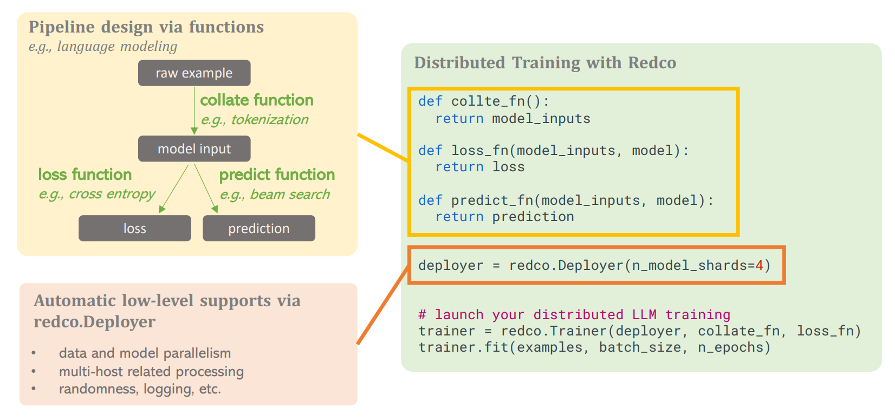

**Red Coast** (redco) is a lightweight and user-friendly tool designed to automate distributed training and inference for large models while simplifying the ML pipeline development process without necessitating MLSys expertise from users.

Check out our [Tech Report Here](https://arxiv.org/pdf/2310.16355.pdf) for details! There is also a [quick tutorial](#quick-tutorial) below.

* Redco allows for the simple implementation of distributed training and inference, eliminating the need for additional coding efforts or complex configurations, but still exhibits efficiency comparable to the most advanced model parallel tools.
* Redco enables customization of arbitrary ML pipelines within three functions, eliminating repetitive ans boilerplate coding, such as multi-host related processing, etc. We demonstrate that this mechanism is widely applicable to various ML algorithms



### Features

* **Lightweight concepts**: *Redco* only introduces three concepts: Deployer, Trainer, and Predictor. You can be an expert in a couple of minites!
* **Easy-to-use**: Customize your pipeline with a couple of functions, each with a handful of lines. Designing your pipeline is the only thing you need to take care with *redco*.
* **Automatic deployment**: No need to take care of your multi-host or multi-device environment. *Redco* processes your environment automatically, as well as other pipeline-unrelated things, e.g., randomness, logging, etc.
* **Automatic model/data parallelism**: No need to concern your large models and large datasets. *Redco* distributes your models and datasets to all your devices automatically. 
* **No need to know JAX**: *Redco* only needs a couple of numpy-like functions as your pipeline design. 

### Installation

#### Install Redco
```
pip install redco
```
For the most up-to-date version:
```
git clone https://github.com/tanyuqian/redco.git
cd redco
pip install -e .
```

#### Adjust Jax & Flax versions
The command above would automatically install cpu version of jax, so the version of Jax need to be adjusted based on your device.

For example,
```
pip install --upgrade flax==0.7.0
pip install --upgrade jax[cuda11_pip]==0.4.13 -f https://storage.googleapis.com/jax-releases/jax_cuda_releases.html
```
Jax version (`==0.4.13`) and Flax version (`==0.7.0`) can be flexible, as long as they match your CUDA/CUDNN/NCCL version. 
Besides, the Flax modeling in the HuggingFace implementation sometimes doesn't support the most recent Jax & Flax versions. 

If you are using TPU/CPU/AMD/Apple, see [here](https://github.com/google/jax#installation) for corresponding installation commands.


### Examples

Examples across a set of paradigms can be found in [examples/](examples/), including

* [classification/regression (GLUE & MNIST)](examples%2Fclassification_regression)
* [faderated learning (FedAvg)](examples%2Ffaderated_learning)
* [image to text (image captioning)](examples%2Fimage_to_text)
* [language modeling (Training LLMs like LLaMA)](examples%2Flanguage_modeling)
* [meta learning (MAML)](examples%2Fmeta_learning)
* [reinforcement learning (PPO & DDPG & MADDPG)](examples%2Freinforcement_learning)
* [text to image (StableDiffusion)](examples%2Ftext_to_image)
* [text to text (Seq2seq)](examples%2Ftext_to_text)

### Exemplar large model settings

The table below shows runnable model LLM finetuning on different kinds of servers. Numbers inside the brackets are the maximum length in training. All the settings are with full precision (fp32) and Adam optimizer.

| 2 $\times$ 1080Ti <br/>(2 $\times$ 10G) | 4 $\times$ A100 <br/>(4 $\times$ 40G) | 2 $\times$ TPU-v4 <br/>(2 hosts $\times$ 4 chips $\times$ 32G) | 16 $\times$ TPU-v4 <br/>(16 hosts $\times$ 4 chips $\times$ 32G) |
|-----------------------------------------|---------------------------------------|----------------------------------------------------------------|------------------------------------------------------------------|
| BART-Large (1024)                       | LLaMA-7B (1024)                       | T5-XL-11B (512)                                                | OPT-66B (512)                                                    |
| GPT2-Large (512)                        | GPT-J-6B (1024)                       | OPT-13B (1024)                                                 |                                                                  |

Go to [example/language_modeling](examples%2Flanguage_modeling) and [examples/text_to_text](examples%2Ftext_to_text) to try them out!


### Quick Tutorial

Below is a template code to customize an arbitrary distributed training pipeline with redco.

* No need to be a jax expert: `numpy` is pretty enough
* No need MLSys knowledge: only specify a number `n_model_shards` to split your model
* ONLY NEED to focus on your algorithm design!

After checking out our [text classification example (glue_main.py)](examples/classification_regression/glue_main.py), you'll be an expert of redco!

```python
def collate_fn(examples, ...):
    # from raw examples to model inputs, e.g., tokenization
    return {'input_ids': input_ids, 'labels': labels}


def loss_fn(train_rng, state, params, batch, is_training, ...):
    # from model inputs defined in collate_fn, run the model and get the loss, e.g., cross_entropy
    logits = model(input_ids=batch['input_ids'], params=params)
    loss = cross_entropy(logits, batch['labels'])
    return loss


def pred_fn(pred_rng, params, batch, model, gen_kwargs):
    # from model inputs defined in collate_fn, run the model and get predictions, e.g., beam search
    batch_preds = model.generate(input_ids=batch['input_ids'],params=params)
    return batch_preds


def output_fn(batch_preds, tokenizer):
    # (optional) post process of output tensors, e.g., decode output_ids to text
    return tokenizer.batch_decode(batch_preds)


def eval_metric_fn(examples, preds):
    # (optional) given test examples and predictions, calculate evaluation metrics, e.g., Rouge-L
    return rouge_scorer.compute(
        predictions=preds,
        references=[example['target'] for example in examples],
        rouge_types=['rouge1', 'rouge2', 'rougeL'])

# define seed, workdir, tensorboard, wandb, multi-host env, etc.
deployer = redco.Deployer(
    jax_seed=jax_seed, # randomness control
    n_model_shards=n_model_shards, # how many pieces to split the model (the only number needed for model parallelism)
    workdir=workdir, run_tensorboard=True, run_wandb=True, # logging utils
    host0_address='111.222.333.444', n_processes=2 # setup multi-host env  
) 

train_examples, valid_examples = load_dataset(...) # load dataset into python-list
model, params = FlaxModel() # a model defined in flax, e.g., transformers.FlaxT5ForConditionalGeneration()
optimizer = adam(lr=0.001) # a optimizer defined in optax 

# define redco.Trainer
trainer = redco.Trainer(
    deployer=deployer,
    collate_fn=collate_fn,
    loss_fn=loss_fn, 
    params=params, 
    optimizer=optimizer,
    params_sharding_rules=deployer.get_sharding_rules(params) # automatically generated model parallelism  
)

# define redco.Predictor for prediction and evaluation during training
predictor = trainer.get_default_predictor(
    pred_fn=pred_fn, output_fn=output_fn)

# pass in your training config and run the training
trainer.fit(
    train_examples=train_examples,
    per_device_batch_size=per_device_batch_size,
    n_epochs=n_epochs,
    eval_examples=valid_examples,
    eval_per_device_batch_size=eval_per_device_batch_size,
    eval_loss=True, # if compute loss on eval_examples after each epoch
    eval_predictor=predictor, # run prediction on eval_examples after each epoch
    eval_metric_fn=eval_metric_fn, # eval_metric_fn above
    eval_sanity_check=True,
    save_every_ckpt=False,
    save_last_ckpt=True,
    save_argmin_ckpt_by_metrics=None,
    save_argmax_ckpt_by_metrics=['rouge-L'], # save the model with the best rouge-L score defined in eval_metric_fn
    save_opt_states=True)
```


## Acknowledgement


The name of this package, *Redco*, is inspired by *Red Coast Base*, a key location in the story of Three-Body. From Red Coast Base, humanity broadcasts its first message into the vast universe. We thank Cixin Liu for such a masterpiece!

