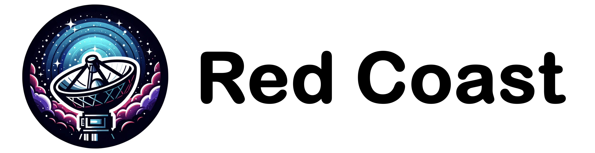
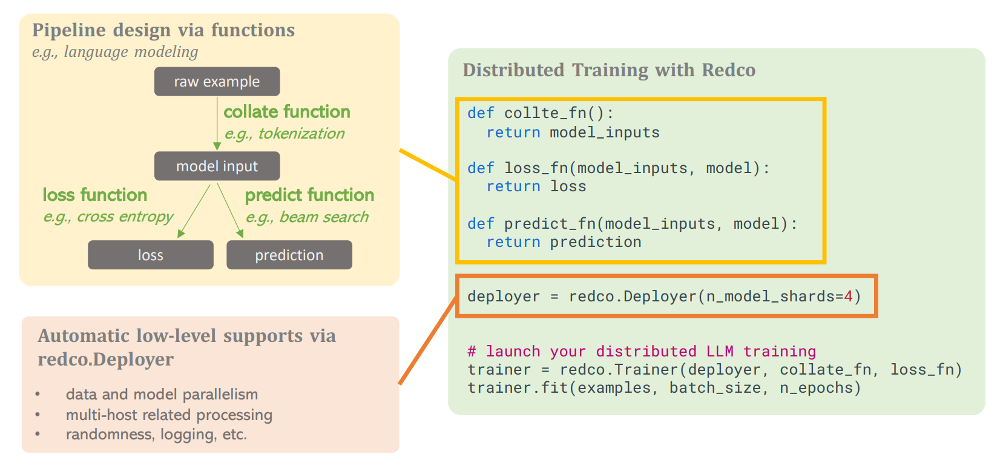

**Red Coast** (redco) is a lightweight and user-friendly tool designed to automate distributed training and inference for large models while simplifying the ML pipeline development process without necessitating MLSys expertise from users.

RedCoast supports *Large Models* + *Complex Algorithms*, in a *lightweight* and *user-friendly* manner: 

* Large Models beyond Transformers, e.g, [Stable Diffusion](https://github.com/tanyuqian/redco/examples/text_to_image), etc.
* Complex algorithms beyond cross entropy, e.g., [Meta Learning](https://github.com/tanyuqian/redco/examples/meta_learning), etc.

With RedCoast, to define a ML pipeline, only three functions are needed:

* *Collate function*: convert raw data examples into model inputs (e.g., text tokenization);
* *Loss function*: execute the model and compute loss (e.g., cross-entropy);
* *Predict function* to run the model and deliver outcomes (e.g., beam search).

Redco *automates all the remaining* of pipeline execution such as data and model parallelism, multi-host related processing, distributed checkpointing, randomness controlling, logging, etc.

