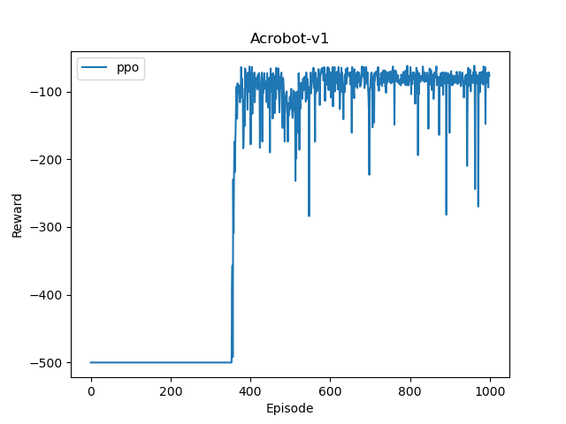
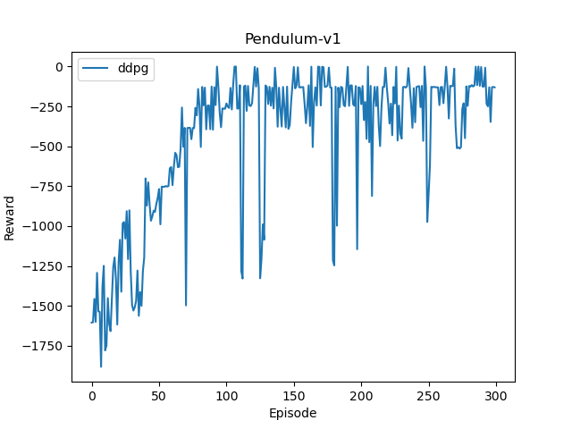

## Reinforcement Learning (PPO/DDPG)

This example implements common reinforcement learning algorithms. 
* PPO (on Gym Games with discrete action space).
* DDPG (on Gym Games with continuous action space).


### Requirement

Install Redco
```shell
pip install redco==0.4.13
```

(For PPO and DDPG) Install [Gymnasium](https://gymnasium.farama.org/index.html) (maintaining OpenAI's Gym)
```shell
pip install gymnasium==0.29.1
```


### Usage

#### PPO
```shell
python ppo_main.py --env_name Acrobot-v1 --n_episodes 1000
```
* `--env_name` should a game in [Gymnasium](https://gymnasium.farama.org/index.html) with discrete action space.

See `def main(...)` in [ppo_main.py](ppo_main.py) for all the tunable arguments. 

#### DDPG
```shell
python ddpg_main.py --env_name Pendulum-v1 --n_episodes 200
```
* `--env_name` should a game in [Gymnasium](https://gymnasium.farama.org/index.html) with continuous action space.

See `def main(...)` in [ddpg_main.py](ddpg_main.py) for all the tunable arguments.

### Results


| PPO                                                               | DDPG                                                                | 
|-------------------------------------------------------------------|---------------------------------------------------------------------|
|  |  |


